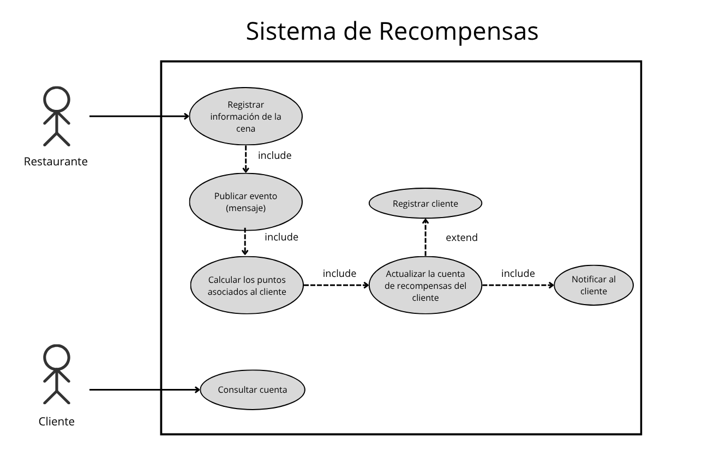
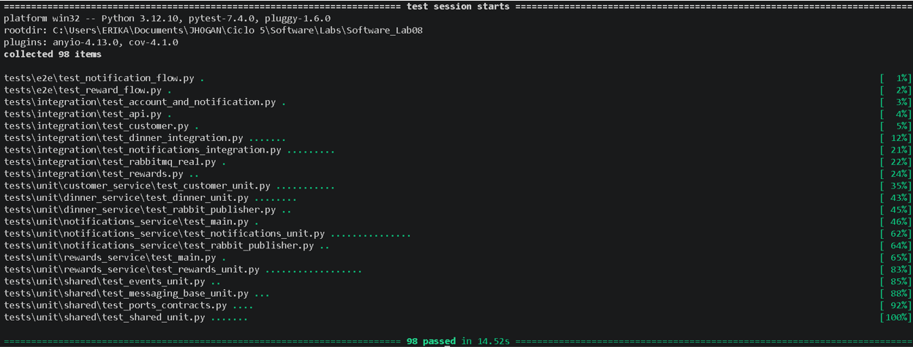
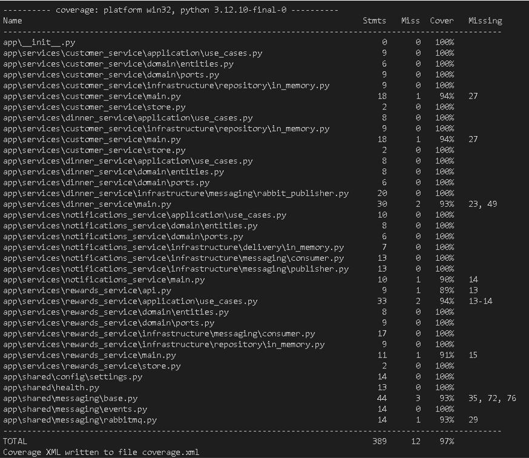
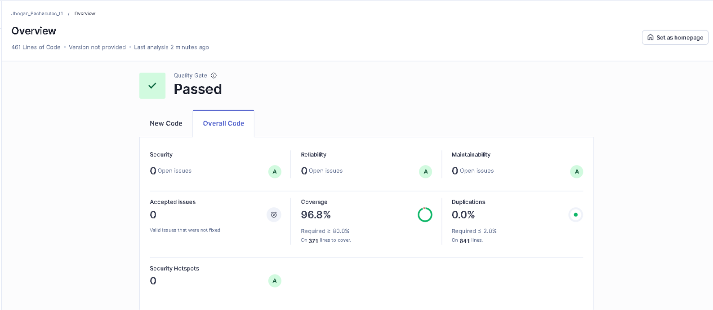

# Software_Lab08

Repositorio GitHub: https://github.com/Jhogan563P/Software_Lab08.git

Análisis SonarQube: https://sonarqube.ingsoftware.lat/dashboard?id=Jhogan_Pachacutec_t1&codeScope=overall


### 1. Introducción
El proyecto implementa un sistema distribuido orientado al proceso de registro de cenas, cálculo de recompensas y notificación al cliente. La solución combina servicios HTTP, mensajería asíncrona con RabbitMQ y persistencia en memoria para facilitar pruebas automatizadas y validación funcional.

### 2. Diagrama de caso de uso
La figura de caso de uso se presenta como referencia funcional del sistema.



En este flujo intervienen principalmente dos actores externos. El **Restaurante** registra la información de la cena realizada, mientras que el **Cliente** participa como beneficiario de las recompensas y como actor asociado a la consulta posterior de su cuenta. A partir de esa interacción, el sistema procesa internamente la transacción y publica un mensaje en RabbitMQ con el monto consumido, el número de tarjeta, el código del restaurante y la fecha y hora de la transacción.

Después, el microservicio de recompensas consume el mensaje, calcula los puntos y cashback asociados, y actualiza la cuenta del cliente. Si no existe una cuenta previa asociada al identificador de la tarjeta, el sistema crea automáticamente una nueva cuenta para no interrumpir el procesamiento. Posteriormente, se genera un evento adicional para notificar al cliente por correo o por otro canal equivalente. En el diagrama, este recorrido se complementa con el caso de uso de consultar cuenta, que permite al cliente visualizar el estado actualizado de sus recompensas.

La decisión de crear automáticamente una nueva cuenta de recompensas cuando no existe una asociación previa con la tarjeta del cliente responde a dos criterios:

1. El enunciado del laboratorio no especifica una restricción explícita que obligue a registrar al cliente antes de procesar una cena.
2. La implementación busca mantener el flujo operativo sin bloquear el cálculo de recompensas, permitiendo que el sistema continúe aun cuando el cliente no tenga un registro previo.

En ese sentido, el comportamiento automático funciona como una regla interna de consistencia del dominio y no como una acción manual del actor.

### 3. Arquitectura implementada
La arquitectura corresponde a un enfoque de **microservicios** con una organización interna de estilo **hexagonal / ports and adapters**. Cada servicio separa claramente el dominio de la infraestructura y expone una API o consumidor específico según su responsabilidad.

La solución se organiza en cuatro capas principales:

| Capa | Responsabilidad | Ejemplos |
|---|---|---|
| Presentación | Exponer endpoints HTTP y puntos de arranque | `main.py`, `api.py` |
| Aplicación | Orquestar casos de uso | `application/use_cases.py` |
| Dominio | Modelar entidades y contratos | `domain/entities.py`, `domain/ports.py` |
| Infraestructura | Implementar repositorios, publicadores y consumidores | `infrastructure/...` |

Además, existe un módulo compartido con configuración, salud y mensajería base en `app/shared/`.

#### 3.1 Justificación de la arquitectura observada
La implementación evidencia un grado alto de madurez arquitectónica por las siguientes razones:

- **Alta cohesión:** cada servicio agrupa una responsabilidad concreta. `customer_service` gestiona clientes, `dinner_service` registra cenas, `rewards_service` procesa recompensas y `notifications_service` emite notificaciones. En cada caso, los archivos de dominio, aplicación e infraestructura colaboran para un único objetivo funcional.
- **Bajo acoplamiento:** las dependencias entre capas se resuelven mediante puertos e interfaces abstractas. El dominio no conoce las clases concretas de infraestructura, y los casos de uso reciben repositorios, publishers o senders como dependencias inyectadas.
- **Modularidad:** el código está dividido por servicio y por capa, lo que permite modificar una parte sin impactar directamente a las demás. Además, los adaptadores en memoria y RabbitMQ pueden sustituirse sin cambiar la lógica central.
- **Escalabilidad:** la separación por servicios y el uso de colas de mensajería permite escalar de forma independiente los componentes que consumen o publican eventos. Esto es especialmente útil cuando llegan muchos registros de cena al mismo tiempo o cuando varios usuarios realizan compras en paralelo, porque el productor no queda bloqueado esperando el procesamiento inmediato del consumidor. Al desacoplar la publicación del evento y su procesamiento, el sistema puede absorber picos de demanda en tiempo real y distribuir la carga entre productores y consumidores según la necesidad operativa.
- **Arquitectura orientada a eventos:** el flujo principal no depende solo de llamadas síncronas. El registro de una cena genera un evento que viaja por RabbitMQ, luego otro servicio lo consume, procesa recompensas y publica un nuevo evento para notificación. Esto refleja un sistema basado en eventos y no en una secuencia rígida de invocaciones directas.

#### 3.2 Justificación de RabbitMQ frente a otras opciones
RabbitMQ fue la opción más adecuada para esta implementación por la naturaleza del problema y por el alcance del laboratorio:

1. **Adecuación al problema:** el laboratorio necesita entregar mensajes confiables entre productores y consumidores para procesar una cena y generar recompensas. RabbitMQ encaja mejor que Kafka porque se ajusta a colas de trabajo y eventos discretos, sin introducir la complejidad de streaming o retención histórica prolongada.
2. **Simplicidad operativa y de pruebas:** para un entorno académico con pruebas automatizadas y ejecución local, RabbitMQ resulta más fácil de configurar, observar y validar. Además, permite trabajar con ACKs, colas y exchanges sin requerir infraestructura adicional innecesaria.
3. **Comparación con ActiveMQ:** aunque ActiveMQ también cumpliría la función de mensajería, RabbitMQ ofrece una integración más natural con el patrón de productor-consumidor usado en esta implementación, por lo que resulta una opción más directa y coherente con el diseño del sistema.

### 4. Patrón arquitectónico utilizado
El patrón predominante es **Arquitectura Hexagonal (Ports and Adapters)**, complementado con una **arquitectura orientada a eventos (EDA)**.

Se reconoce por:

| Elemento | Función |
|---|---|
| Ports | Interfaces abstractas del dominio (`ports.py`) |
| Adapters | Implementaciones concretas en memoria o RabbitMQ |
| Use cases | Reglas de negocio orquestadas desde la capa de aplicación |
| Mensajería | Comunicación asíncrona entre servicios |

Este enfoque reduce el acoplamiento entre negocio e infraestructura y permite que los tests sustituyan fácilmente repositorios, publishers y consumidores por dobles de prueba.

### 5. Evidencia de pruebas automatizadas
La ejecución automatizada de pruebas confirma que la suite pasa correctamente.



Para ejecutar las pruebas automatizadas se puede seguir uno de estos dos estilos:

1. Activar previamente el entorno virtual y usar los comandos de manera directa.
2. Llamar al intérprete del entorno virtual con la ruta explícita cuando no se desea activar la sesión.

En este informe se usará el primer estilo:

Comando de prueba:

```powershell
pytest
```

### 6. Cobertura de código
El archivo `coverage.xml` reporta una cobertura total de **96.92%** sobre **389 líneas válidas**, con **377 líneas cubiertas**.

En la captura de cobertura se observa un resultado global redondeado de **97%**.



Para generar nuevamente el reporte de cobertura se puede usar:

```powershell
python -m pytest --cov=app --cov-report=term-missing --cov-report=xml
```

### 7. Métricas de calidad en SonarQube
El análisis de SonarQube muestra un estado favorable del proyecto:

- Quality Gate: Passed
- Security: 0 issues abiertas
- Reliability: 0 issues abiertas
- Maintainability: 0 issues abiertas
- Duplications: 0.0%
- Coverage reportada en SonarQube: 96.8%
- Security Hotspots: 0



### 8. Ejecución local del sistema
El proyecto fue trabajado con un entorno virtual de Python previamente creado. Antes de ejecutar los servicios o las pruebas, se recomienda activar ese entorno e instalar las dependencias del archivo `requirements.txt`.

```powershell
pip install -r requirements.txt
```

Los comandos de ejecución de los componentes principales son:

```powershell
python -m app.services.customer_service.main
python -m app.services.dinner_service.main
python -m app.services.notifications_service.main
python -m app.services.rewards_service.main
```